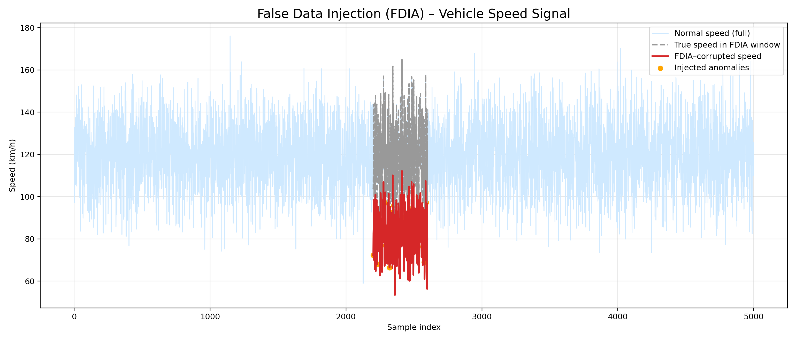
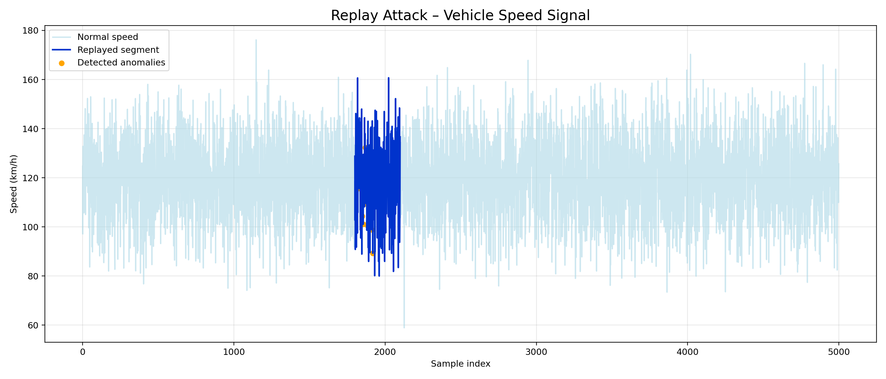
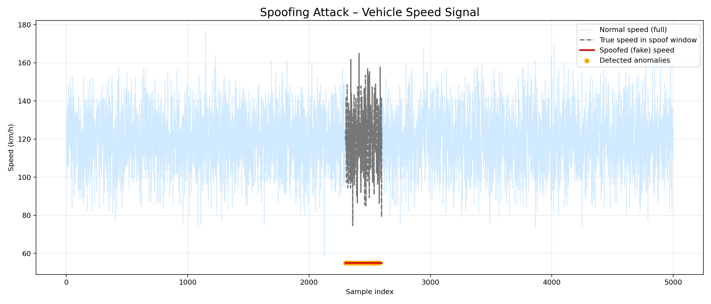
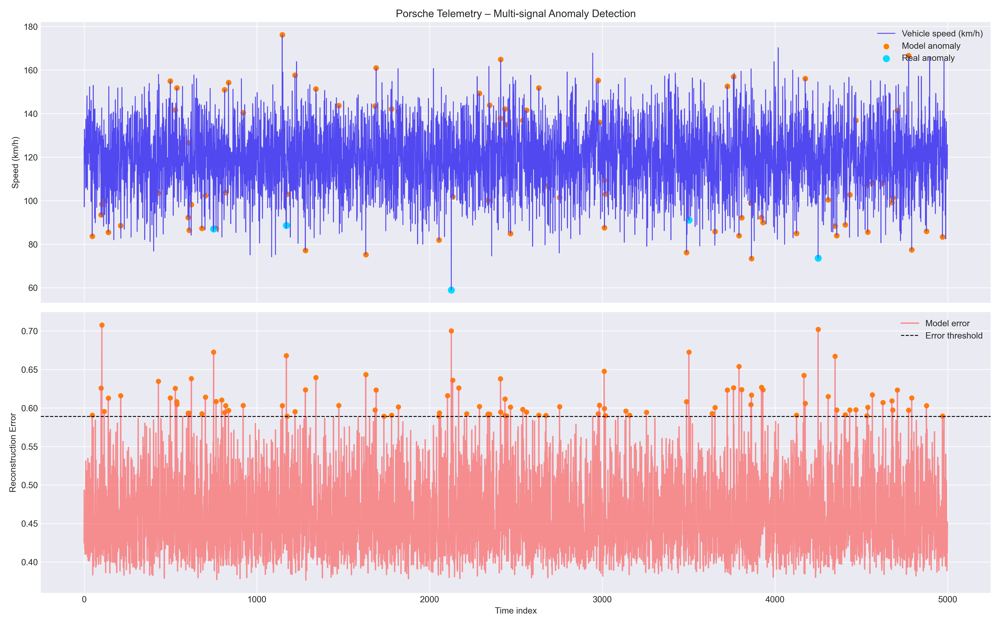
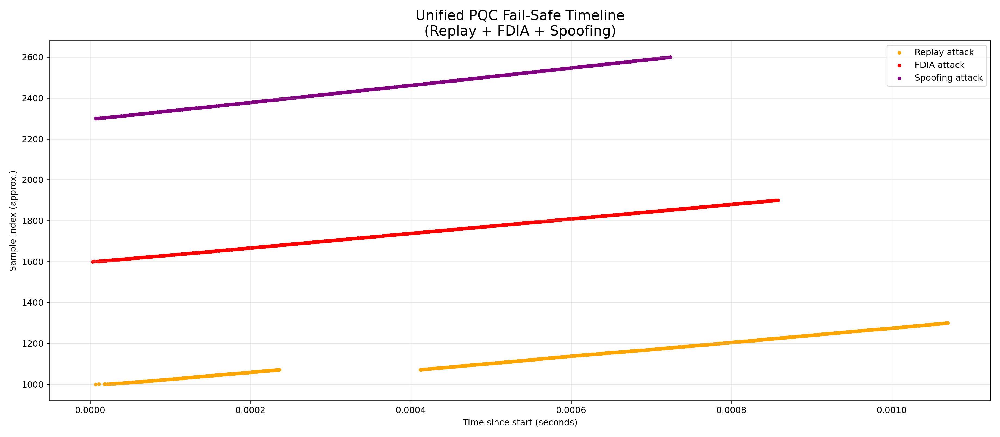

# HQC BadPK — Post-Quantum Cryptography Testbed for Automotive Security

> **3rd Place** — National Quantum and Deep Tech Entrepreneurship Competition 2025  
> (The Venture Vibe + UNESCO, Istanbul Feriye Palace)  
> Solo student researcher · Advisor: Durgun Duran

---

## The Problem

Modern vehicles receive software updates over the internet (OTA), communicate with road infrastructure (V2X), and run dozens of Electronic Control Units (ECUs) that process safety-critical data. All of this relies on classical cryptography — RSA, ECDSA, ECDH — which **Shor's algorithm running on a sufficiently powerful quantum computer can break in polynomial time**.

Vehicles manufactured today will still be on the road in 2035–2040. That is the quantum threat window.

**This project investigates what happens when post-quantum cryptographic primitives are applied to automotive security scenarios.**

---

## What This Project Does

Three layers of defense are implemented and tested:

| Layer | Algorithm | Protects Against |
|-------|-----------|-----------------|
| Key Exchange | HQC-128 (KEM) | Eavesdropping on the secure channel |
| Firmware Signing | ML-DSA-44 (Dilithium) | Fake or tampered OTA updates |
| Sensor Integrity | Isolation Forest + Failsafe ECU | FDIA, Replay, Spoofing attacks |

---

## Architecture

```
┌─────────────────────────────────────────────────────────────┐
│                    SERVER SIDE                      │
│                                                             │
│   ML-DSA-44 keypair          HQC-128 keypair                │
│   Sign firmware  ──────┐     Encapsulate session key ──┐   │
└────────────────────────┼────────────────────────────────┼───┘
                         │  OTA Channel (TLS-PQC)          │
┌────────────────────────┼────────────────────────────────┼───┐
│                    VEHICLE ECU SIDE                      │   │
│                                                          │   │
│   Verify signature ◄───┘     Decapsulate session key ◄──┘   │
│   Accept / Reject                                           │
│         │                                                   │
│   Failsafe ECU ◄──── Sensor Anomaly Detection              │
└─────────────────────────────────────────────────────────────┘
```

---

## Repository Structure

```
HQC_BadPK_Test/
│
├── experiments/
│   ├── badpk.c              # Mock KEM: BadPK failure behavior (educational)
│   └── badpk_real.c         # Real HQC-128: IND-CCA2 BadPK rejection test
│
├── demo/
│   ├── failsafe_car/
│   │   ├── main_demo.c              # HQC-128 KEM + AES-GCM end-to-end demo
│   │   ├── aes_gcm.{c,h}            # AES-256-GCM payload encryption (OpenSSL EVP)
│   │   ├── failsafe_ecu.{c,h}       # ECU state machine with failsafe trigger
│   │   ├── packet_format.{c,h}      # Secure packet with CRC-32 integrity
│   │   ├── generate_telemetry.py    # Synthetic automotive telemetry (5000 samples)
│   │   ├── anomaly_model.py         # Isolation Forest anomaly detection
│   │   ├── anomaly_plot_final.py    # Multi-signal visualization
│   │   ├── attacks/
│   │   │   ├── attack_fdia.py       # False Data Injection Attack
│   │   │   ├── attack_replay.py     # Replay Attack
│   │   │   ├── attack_spoofing.py   # GPS/Sensor Spoofing
│   │   │   ├── event_engine.py      # Attack event logging
│   │   │   ├── secure_layer.py      # PQC-aware packet validation layer
│   │   │   └── timeline_*.py        # Per-attack timeline visualizations
│   │   └── tests_a1/                # Unit tests (CRC, keypair, cipher, failsafe)
│   │
│   └── ota_update/
│       └── ota_demo.c               # ML-DSA-44 OTA firmware signing + verification
│
├── support/
│   └── randombytes.{c,h}    # Cryptographically secure RNG wrapper
│
├── scripts/
│   └── parse_logs.py        # Log parser for test output comparison
│
├── vendor/
│   └── pqclean/             # PQClean reference implementations (submodule)
│
└── Makefile                 # Build targets: mock | real | demo | ota
```

---

## Cryptographic Primitives

### HQC-128 (Hamming Quasi-Cyclic)
- **Type:** Code-based Key Encapsulation Mechanism (KEM)
- **Security:** IND-CCA2, NIST Level 1 (128-bit post-quantum)
- **Key sizes:** PK = 2249 B · SK = 2305 B · CT = 4433 B · SS = 64 B
- **Source:** PQClean reference implementation

### ML-DSA-44 (Module Lattice Digital Signature)
- **Type:** Lattice-based digital signature (CRYSTALS-Dilithium)
- **Security:** NIST FIPS 204, Level 2 (128-bit post-quantum)
- **Key sizes:** PK = 1312 B · SK = 2560 B · Sig = 2420 B
- **Source:** PQClean reference implementation

### AES-256-GCM
- **Type:** Authenticated encryption
- **Usage:** Payload encryption after KEM key exchange
- **Source:** OpenSSL EVP API

---

## Attack Scenarios & Results

### 1. BadPK — Corrupted Public Key

A single bit is flipped in the public key before encapsulation.

| Mode | Result |
|------|--------|
| Mock KEM | `badpk match = NO` |
| HQC-128 | `dec(badpk) fail` |

```
PK=2249 SK=2305 CT=4433 SS=64
enc: 18 C5 B7 D8 E1 D4 86 96
dec: 18 C5 B7 D8 E1 D4 86 96
baseline match = YES
dec(badpk) fail
```

---

### 2. OTA Firmware Tampering (ML-DSA-44)

```
[SERVER] PK size : 1312 bytes
[SERVER] Sig size: 2420 bytes

[ECU] Signature VALID   -> Firmware accepted, installing...

[ATTACK] Tampering with firmware (bit flip)...
[ECU] Signature INVALID -> Tampered firmware REJECTED.

[ATTACK] Sending forged signature...
[ECU] Signature INVALID -> Forged signature REJECTED.
```

---

### 3. Sensor-Level Attacks

Attacks are simulated on 5000 samples of synthetic vehicle telemetry  
(speed, RPM, throttle, brake, steering, engine temp, battery voltage).

#### False Data Injection Attack (FDIA)
Speed signal corrupted by 35% reduction + bias offset in a 400-sample window.



#### Replay Attack
A past 300-sample segment replayed at a later position.



#### Spoofing Attack
Speed signal replaced with a constant fake value (55 km/h).



#### Anomaly Detection
Multi-signal Isolation Forest detects injected anomalies across all attack types.



#### Combined Attack Timeline



---

## Build & Run

### Requirements

- clang or gcc
- OpenSSL (`brew install openssl` on macOS)
- Python 3.9+ with `numpy`, `pandas`, `scikit-learn`, `matplotlib`

### Clone

```bash
git clone --recurse-submodules https://github.com/19saye/HQC_BadPK_Test.git
cd HQC_BadPK_Test
```

### Build

```bash
make real      # HQC-128 BadPK test
make ota       # ML-DSA-44 OTA firmware signing demo
make clean     # Remove compiled binaries
```

### Run

```bash
# HQC-128 BadPK
./badpk_real

# OTA Firmware Signing
./demo/ota_update/ota_demo

# Generate telemetry data
python3 demo/failsafe_car/generate_telemetry.py

# Anomaly detection + plots
python3 demo/failsafe_car/anomaly_plot_final.py

# Attack simulations
python3 demo/failsafe_car/attacks/attack_fdia.py
python3 demo/failsafe_car/attacks/attack_replay.py
python3 demo/failsafe_car/attacks/attack_spoofing.py
```

---

## Summary Table

| Scenario | Classical Crypto | This Project (PQC) |
|----------|-----------------|-------------------|
| BadPK injection | Implementation-dependent | Correctly rejected (IND-CCA2) |
| OTA firmware tamper | RSA/ECDSA broken by Shor | ML-DSA-44 quantum-resistant |
| Sensor FDIA | No cryptographic binding | Anomaly detection + failsafe |
| Replay attack | Timestamp only | PQC channel + event detection |

---

## Motivation

Vehicles produced today will operate until 2035–2040. Classical cryptographic algorithms (RSA-2048, ECDSA-256) are expected to be broken by quantum computers within that timeframe. The automotive industry is governed by **ISO 21434** (cybersecurity) and **UNECE WP.29** (OTA security), both of which acknowledge the quantum threat but do not yet mandate post-quantum algorithms.

This project demonstrates a practical, standards-aligned path toward post-quantum automotive security using NIST-standardized algorithms on real reference implementations.

---

## Tools & Libraries

| Tool | Purpose |
|------|---------|
| [PQClean](https://github.com/PQClean/PQClean) | Reference PQC implementations (HQC-128, ML-DSA-44) |
| OpenSSL EVP | AES-256-GCM authenticated encryption |
| scikit-learn | Isolation Forest anomaly detection |
| NumPy / pandas | Telemetry data generation and processing |
| matplotlib | Attack and anomaly visualizations |
| clang / C11 | Core cryptographic layer |

---

## License

MIT — see [LICENSE](LICENSE)

---

> This repository is an independent academic study.  
> All implementations use reference code from PQClean. Not for production use.
